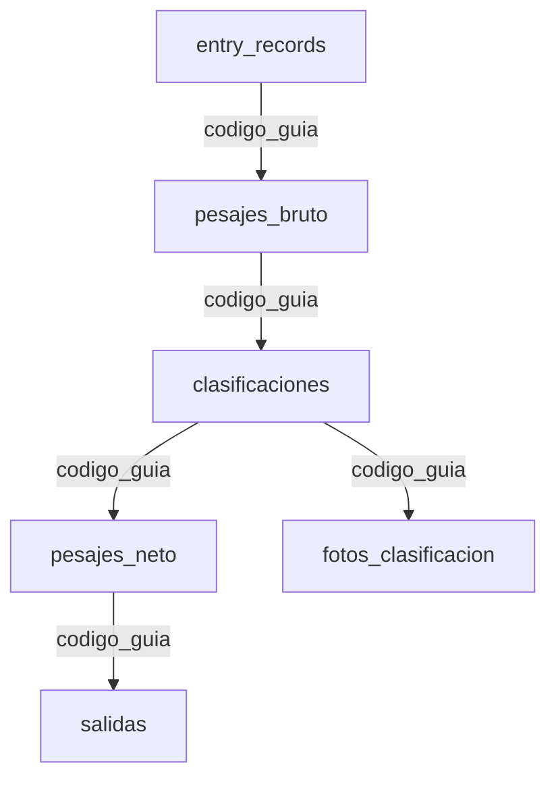
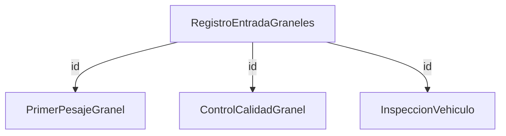

# Análisis de Estructura de Base de Datos y Esquemas - TiquetesApp

**Fecha**: Enero 2025  
**Objetivo**: Documentar la estructura completa de base de datos SQLite para facilitar la migración a Oleoflores Smart Flow

---

## Resumen Ejecutivo

El sistema TiquetesApp utiliza **SQLite** como base de datos principal con **dos archivos** de base de datos activos:
- **`tiquetes.db`** (raíz) - Base de datos completa con 13 tablas incluyendo graneles
- **`instance/tiquetes.db`** - Base de datos básica con 6 tablas del flujo principal

Total identificado: **13 tablas** operativas con **116 registros activos** distribuidos entre flujo principal y graneles.

---

## 1. Inventario de Bases de Datos

### 1.1 Bases de Datos Activas

| Archivo | Ubicación | Propósito | Tablas | Estado |
|---------|-----------|-----------|---------|---------|
| `tiquetes.db` | Raíz del proyecto | BD completa del sistema | 13 tablas | ✅ Activa - Principal |
| `instance/tiquetes.db` | `/instance/` | BD del flujo básico | 6 tablas | ✅ Activa - Secundaria |

### 1.2 Bases de Datos de Respaldo Identificadas

| Archivo | Ubicación | Propósito |
|---------|-----------|-----------|
| `database.db` | Raíz | BD legacy/alternativa |
| `app/data/guides.db` | `/app/data/` | BD de guías |
| `archive/databases/database.db` | `/archive/` | BD archivada |
| `tiquetes_backup_*.db` | Raíz | Respaldos automáticos |

---

## 2. Estructura de Tablas por Módulo

### 2.1 Tablas del Flujo Principal (6 tablas)

#### 2.1.1 entry_records - Registros de Entrada
**Propósito**: Almacena los datos iniciales de registro de entrada de vehículos  
**Registros actuales**: 37  
**Uso**: Módulo `entrada`

```sql
CREATE TABLE entry_records (
    id INTEGER PRIMARY KEY AUTOINCREMENT,
    codigo_guia TEXT UNIQUE NOT NULL,
    nombre_proveedor TEXT,
    codigo_proveedor TEXT,
    timestamp_registro_utc TEXT,
    num_cedula TEXT,
    num_placa TEXT,
    placa TEXT,
    conductor TEXT,
    transportador TEXT,
    codigo_transportador TEXT,
    tipo_fruta TEXT,
    cantidad_racimos INTEGER,
    acarreo TEXT,
    cargo TEXT,
    nota TEXT,
    lote TEXT,
    image_filename TEXT,
    modified_fields TEXT,    -- JSON con campos modificados
    fecha_tiquete TEXT,
    pdf_filename TEXT,
    qr_filename TEXT,
    is_madre INTEGER DEFAULT 0,   -- 0=Normal, 1=Madre
    hijas_str TEXT,              -- Códigos hijas separados por comas
    estado TEXT DEFAULT 'activo',
    fecha_creacion TIMESTAMP DEFAULT CURRENT_TIMESTAMP
);
```

**Campos críticos**:
- `codigo_guia`: Clave primaria lógica del sistema (formato: `{codigo_proveedor}_{timestamp}_{secuencia}`)
- `modified_fields`: JSON string con campos modificados por usuario
- `is_madre`/`hijas_str`: Sistema de agrupación de guías

#### 2.1.2 pesajes_bruto - Pesajes Brutos
**Propósito**: Almacena datos de pesaje inicial/bruto  
**Registros actuales**: 32  
**Uso**: Módulo `pesaje`

```sql
CREATE TABLE pesajes_bruto (
    id INTEGER PRIMARY KEY AUTOINCREMENT,
    codigo_guia TEXT UNIQUE NOT NULL,
    codigo_proveedor TEXT,
    nombre_proveedor TEXT,
    peso_bruto REAL,
    tipo_pesaje TEXT,           -- 'directo', 'virtual', etc.
    timestamp_pesaje_utc TEXT,
    imagen_pesaje TEXT,         -- Ruta a imagen de báscula
    codigo_guia_transporte_sap TEXT,  -- Código SAP generado
    estado TEXT DEFAULT 'activo',
    fecha_creacion TIMESTAMP DEFAULT CURRENT_TIMESTAMP
);
```

**Campos críticos**:
- `peso_bruto`: Peso en kilogramos 
- `codigo_guia_transporte_sap`: Integración con sistema SAP
- `imagen_pesaje`: OCR de báscula mediante webhook

#### 2.1.3 clasificaciones - Clasificación de Racimos
**Propósito**: Almacena resultados de clasificación manual y automática (IA)  
**Registros actuales**: 11  
**Uso**: Módulo `clasificacion`

```sql
CREATE TABLE clasificaciones (
    id INTEGER PRIMARY KEY AUTOINCREMENT,
    codigo_guia TEXT UNIQUE NOT NULL,
    codigo_proveedor TEXT,
    nombre_proveedor TEXT,
    timestamp_clasificacion_utc TEXT,
    -- Clasificación Manual (porcentajes)
    verde_manual REAL,
    sobremaduro_manual REAL,
    danio_corona_manual REAL,
    pendunculo_largo_manual REAL,
    podrido_manual REAL,
    -- Clasificación Automática IA (porcentajes)
    verde_automatico REAL,
    sobremaduro_automatico REAL,
    danio_corona_automatico REAL,
    pendunculo_largo_automatico REAL,
    podrido_automatico REAL,
    -- Datos JSON Completos
    clasificacion_manual_json TEXT,     -- JSON con datos detallados manual
    clasificacion_automatica_json TEXT, -- JSON con datos detallados IA
    clasificacion_manual TEXT,          -- Resumen texto manual
    clasificacion_automatica TEXT,      -- Resumen texto IA
    observaciones TEXT,
    -- Datos Consolidados
    total_racimos_detectados INTEGER,
    clasificacion_consolidada TEXT,     -- JSON: {categoria: {cantidad: X, porcentaje: Y}}
    fecha_actualizacion TEXT,
    hora_actualizacion TEXT,
    timestamp_fin_auto TEXT,
    tiempo_procesamiento_auto REAL,    -- Segundos
    estado TEXT DEFAULT 'activo',
    fecha_creacion TIMESTAMP DEFAULT CURRENT_TIMESTAMP
);
```

**Tecnologías integradas**:
- **Manual**: Interface web con formularios
- **Automática**: Roboflow API + modelos pre-entrenados
- **Consolidación**: Algoritmo que combina ambos resultados

#### 2.1.4 pesajes_neto - Pesajes Netos/Tara
**Propósito**: Almacena datos de pesaje final (neto) tras descontar tara  
**Registros actuales**: Datos en `tiquetes.db`  
**Uso**: Módulo `pesaje_neto`

```sql
CREATE TABLE pesajes_neto (
    id INTEGER PRIMARY KEY AUTOINCREMENT,
    codigo_guia TEXT UNIQUE NOT NULL,
    codigo_proveedor TEXT,
    nombre_proveedor TEXT,
    peso_bruto REAL,
    peso_tara REAL,
    peso_neto REAL,              -- peso_bruto - peso_tara
    peso_producto REAL,          -- Peso final del producto
    tipo_pesaje_neto TEXT,
    timestamp_pesaje_neto_utc TEXT,
    comentarios TEXT,
    respuesta_sap TEXT,          -- Respuesta de validación SAP
    estado TEXT DEFAULT 'activo',
    fecha_creacion TIMESTAMP DEFAULT CURRENT_TIMESTAMP
);
```

#### 2.1.5 salidas - Registro de Salidas
**Propósito**: Registro final de salida de vehículos del proceso completo  
**Registros actuales**: Datos en `tiquetes.db`  
**Uso**: Módulo `salida`

```sql
CREATE TABLE salidas (
    id INTEGER PRIMARY KEY AUTOINCREMENT,
    codigo_guia TEXT UNIQUE NOT NULL,
    codigo_proveedor TEXT,
    nombre_proveedor TEXT,
    timestamp_salida_utc TEXT,
    comentarios_salida TEXT,
    firma_salida TEXT,           -- Firma digital o imagen
    estado TEXT DEFAULT 'completado',
    fecha_creacion TIMESTAMP DEFAULT CURRENT_TIMESTAMP
);
```

#### 2.1.6 fotos_clasificacion - Fotos de Clasificación
**Propósito**: Referencias a imágenes utilizadas en clasificación  
**Registros actuales**: Datos en ambas BD  
**Uso**: Módulo `clasificacion` (soporte)

```sql
CREATE TABLE fotos_clasificacion (
    id INTEGER PRIMARY KEY AUTOINCREMENT,
    codigo_guia TEXT NOT NULL,
    ruta_foto TEXT NOT NULL,
    numero_foto INTEGER,
    tipo_foto TEXT,
    fecha_subida TEXT,
    hora_subida TEXT,
    estado TEXT DEFAULT 'activo',
    fecha_creacion TIMESTAMP DEFAULT CURRENT_TIMESTAMP,
    FOREIGN KEY (codigo_guia) REFERENCES clasificaciones(codigo_guia)
);
```

### 2.2 Tablas del Sistema de Graneles (4 tablas)

#### 2.2.1 RegistroEntradaGraneles - Registro Principal Graneles
**Propósito**: Sistema independiente para productos graneles (aceites, etc.)  
**Registros actuales**: 34  
**Uso**: Módulo `graneles`

```sql
CREATE TABLE RegistroEntradaGraneles (
    id INTEGER PRIMARY KEY AUTOINCREMENT,
    -- Datos Básicos del Registro
    producto TEXT,
    fecha_autorizacion TEXT,
    placa TEXT,
    trailer TEXT,
    cedula_conductor TEXT,
    nombre_conductor TEXT,
    telefono_conductor TEXT,
    transportadora TEXT,
    cliente TEXT,
    tipo_venta TEXT,
    origen TEXT,
    destino TEXT,
    kg_cargar TEXT,
    
    -- Información General (Portería)
    localidad TEXT,
    transportadora_inspeccion TEXT,
    arl TEXT,
    eps TEXT,
    celular_inspeccion TEXT,
    
    -- Documentos de Vencimiento (OCR + LangChain)
    vencimiento_arl TEXT,           -- Fecha YYYY-MM-DD
    vencimiento_soat TEXT,
    vencimiento_tecnomecanica TEXT,
    vencimiento_licencia TEXT,
    foto_arl TEXT,                  -- Ruta a imagen
    foto_soat TEXT,
    foto_tecnomecanica TEXT,
    foto_licencia TEXT,
    observaciones_documentos TEXT,
    
    -- Control de Flujo
    estado_registro TEXT DEFAULT 'porteria',  -- 'porteria', 'pendiente_guarda', 'inspeccion_parcial', 'completado'
    timestamp_registro TIMESTAMP DEFAULT CURRENT_TIMESTAMP,
    tipo_registro TEXT,             -- 'gsheet', 'manual'
    observaciones TEXT,
    usuario_registro TEXT
);
```

**Características especiales**:
- **Sistema independiente**: No usa `codigo_guia` del flujo principal
- **OCR + LangChain**: Campos de vencimiento procesados automáticamente
- **Estados de flujo**: Control independiente del proceso graneles

#### 2.2.2 PrimerPesajeGranel - Primer Pesaje Graneles
**Propósito**: Registro del primer pesaje en el proceso graneles  
**Uso**: Módulo `graneles` (proceso)

```sql
CREATE TABLE PrimerPesajeGranel (
    id INTEGER PRIMARY KEY AUTOINCREMENT,
    id_registro_granel INTEGER,
    peso_primer_kg REAL,
    codigo_sap_granel TEXT,
    timestamp_primer_pesaje TIMESTAMP DEFAULT CURRENT_TIMESTAMP,
    usuario_pesaje TEXT,
    foto_soporte_path TEXT,
    FOREIGN KEY (id_registro_granel) REFERENCES RegistroEntradaGraneles(id)
);
```

#### 2.2.3 ControlCalidadGranel - Control de Calidad Graneles
**Propósito**: Control de calidad específico para productos graneles  
**Uso**: Módulo `graneles` (calidad)

```sql
CREATE TABLE ControlCalidadGranel (
    id INTEGER PRIMARY KEY AUTOINCREMENT,
    id_registro_granel INTEGER,
    parametros_calidad TEXT,        -- JSON con parámetros
    resultado_calidad TEXT,         -- 'Aprobado', 'Rechazado', 'Con Observaciones'
    observaciones_calidad TEXT,
    timestamp_calidad TIMESTAMP DEFAULT CURRENT_TIMESTAMP,
    usuario_calidad TEXT,
    foto_soporte_calidad_path TEXT,
    FOREIGN KEY (id_registro_granel) REFERENCES RegistroEntradaGraneles(id)
);
```

#### 2.2.4 InspeccionVehiculo - Inspección de Vehículos Graneles
**Propósito**: Inspección detallada de vehículos para carga de graneles  
**Uso**: Módulo `graneles` (inspección)

```sql
CREATE TABLE InspeccionVehiculo (
    id INTEGER PRIMARY KEY AUTOINCREMENT,
    id_registro_granel INTEGER,
    localidad TEXT,
    transportadora TEXT,
    arl TEXT,
    eps TEXT,
    celular TEXT,
    tipo_vehiculo TEXT,             -- JSON array: ["turbo", "sencillo"]
    producto_cargar TEXT,           -- JSON array: ["patana", "solidos"]
    elementos_seguridad TEXT,       -- JSON object: {"revision_tecnomecanica": "SI"}
    estado_vehiculo TEXT,           -- JSON object: {"valvula_cargue_limpia": "SI"}
    carrotanques TEXT,              -- JSON object: {"tanque_1": {"sin_olor_interno": "SI"}}
    vehiculo_apto_cargue TEXT,      -- "SI" o "NO"
    motivo_rechazo TEXT,
    segunda_aprobacion TEXT,        -- "SI" o "NO"
    numero_tanque_almacenamiento TEXT,
    temperatura_cargue REAL,
    numero_tiquete_bascula TEXT,
    sellos_carrotanque TEXT,        -- JSON object: {"sello_1": "ABC123"}
    observaciones_inspeccion TEXT,
    usuario_inspeccion TEXT,
    timestamp_inspeccion TIMESTAMP DEFAULT CURRENT_TIMESTAMP,
    FOREIGN KEY (id_registro_granel) REFERENCES RegistroEntradaGraneles(id)
);
```

**Características especiales**:
- **Datos JSON complejos**: Múltiples campos JSON para formularios dinámicos
- **Inspección detallada**: Proceso específico para carrotanques
- **Sistema de aprobación**: Doble nivel de validación

### 2.3 Tablas de Soporte (3 tablas)

#### 2.3.1 users - Usuarios del Sistema
**Propósito**: Autenticación y control de acceso  
**Registros actuales**: 2  
**Uso**: Módulo `auth`

```sql
CREATE TABLE users (
    id INTEGER PRIMARY KEY AUTOINCREMENT,
    username TEXT UNIQUE NOT NULL,
    email TEXT UNIQUE NOT NULL,
    password_hash TEXT NOT NULL,    -- Hash bcrypt
    is_active INTEGER DEFAULT 0,   -- 0=Inactivo, 1=Activo
    fecha_creacion TIMESTAMP DEFAULT CURRENT_TIMESTAMP
);
```

#### 2.3.2 presupuesto_mensual - Presupuesto Mensual
**Propósito**: Almacena proyecciones de toneladas por día  
**Uso**: Módulo `presupuesto` (comentado), Dashboard

```sql
CREATE TABLE presupuesto_mensual (
    id INTEGER PRIMARY KEY AUTOINCREMENT,
    fecha_presupuesto TEXT UNIQUE NOT NULL,  -- YYYY-MM-DD
    toneladas_proyectadas REAL,
    fecha_carga TIMESTAMP DEFAULT CURRENT_TIMESTAMP
);
```

#### 2.3.3 validaciones_diarias_sap - Validaciones SAP
**Propósito**: Registro de validaciones diarias contra sistema SAP  
**Uso**: Validaciones automáticas

```sql
-- Tabla inferida de código, no directamente visible en esquema
CREATE TABLE validaciones_diarias_sap (
    id INTEGER PRIMARY KEY AUTOINCREMENT,
    fecha_aplicable_validacion TEXT,    -- YYYY-MM-DD
    timestamp_creacion_utc TEXT,
    peso_neto_total_validado REAL,
    mensaje_webhook TEXT,
    exito_webhook INTEGER,              -- 0=Falló, 1=Exitoso
    ruta_foto_validacion TEXT,
    filtros_aplicados_json TEXT,        -- JSON con filtros aplicados
    fecha_creacion TIMESTAMP DEFAULT CURRENT_TIMESTAMP
);
```

---

## 3. Relaciones y Claves Foráneas

### 3.1 Relaciones del Flujo Principal


**Clave de relación**: `codigo_guia` (TEXT) - Clave primaria lógica

### 3.2 Relaciones del Sistema Graneles


**Clave de relación**: `id` (INTEGER) - Clave primaria física con FOREIGN KEY constraints

### 3.3 Ausencia de Foreign Key Constraints en Flujo Principal
⚠️ **IMPORTANTE**: Las tablas del flujo principal NO utilizan FOREIGN KEY constraints a nivel de base de datos. La integridad referencial se mantiene a nivel de aplicación mediante `codigo_guia`.

---

## 4. Patrones de Datos y Formatos

### 4.1 Formato de Códigos de Guía
**Patrón**: `{codigo_proveedor}_{timestamp}_{secuencia}`  
**Ejemplo**: `0150076A_20250519_155758`  
**Generación**: `app/utils/common.py:CommonUtils.generar_codigo_guia()`

### 4.2 Timestamps UTC
**Formato**: `YYYY-MM-DD HH:MM:SS`  
**Zona horaria**: UTC (convertido desde Bogotá)  
**Campos**: `timestamp_*_utc` en todas las tablas principales

### 4.3 Datos JSON
**Uso extensivo en**:
- `classificaciones`: `clasificacion_*_json`, `clasificacion_consolidada`
- `entry_records`: `modified_fields`
- `InspeccionVehiculo`: Múltiples campos JSON para formularios dinámicos

### 4.4 Estados de Registro
**Flujo principal**: `'activo'`, `'completado'`  
**Graneles**: `'porteria'`, `'pendiente_guarda'`, `'inspeccion_parcial'`, `'completado'`

---

## 5. Operaciones de Base de Datos

### 5.1 Capa de Acceso a Datos
**Archivos principales**:
- `db_operations.py`: Operaciones CRUD para todas las tablas
- `db_utils.py`: Utilidades de conexión y consultas básicas
- `app/utils/common.py`: Función `get_datos_guia()` - consulta principal del sistema

### 5.2 Consulta Principal del Sistema
```sql
-- app/utils/common.py líneas 188-215
SELECT 
    e.*, 
    pb.peso_bruto, pb.timestamp_pesaje_utc, pb.tipo_pesaje, pb.codigo_guia_transporte_sap, 
    c.timestamp_clasificacion_utc, c.clasificacion_manual_json, c.clasificacion_automatica_json,
    pn.peso_tara, pn.peso_neto, pn.peso_producto, pn.timestamp_pesaje_neto_utc,
    s.timestamp_salida_utc, s.comentarios_salida
FROM entry_records e
LEFT JOIN pesajes_bruto pb ON e.codigo_guia = pb.codigo_guia
LEFT JOIN clasificaciones c ON e.codigo_guia = c.codigo_guia
LEFT JOIN pesajes_neto pn ON e.codigo_guia = pn.codigo_guia
LEFT JOIN salidas s ON e.codigo_guia = s.codigo_guia
WHERE e.codigo_guia = ?
```

**Uso**: Utilizada por TODOS los módulos para obtener datos completos de una guía

### 5.3 Patrones CRUD Implementados
**Patrón estándar**:
1. `store_*()`: INSERT o UPDATE (UPSERT)
2. `get_*()`: SELECT con filtros opcionales
3. `get_*_by_codigo_guia()`: SELECT específico por guía

**Archivos especializados**:
- `app/utils/db_budget_operations.py`: Operaciones de presupuesto
- `app/blueprints/utils/db_budget_operations.py`: Operaciones de presupuesto (duplicado)

---

## 6. Configuración y Rutas de Base de Datos

### 6.1 Configuración Principal
**Variable**: `TIQUETES_DB_PATH` en `current_app.config`  
**Valor actual**: Apunta a `instance/tiquetes.db`  
**Definida en**: `app/__init__.py` líneas 162-167

### 6.2 Gestión de Múltiples BD
**Problema identificado**: El sistema busca en múltiples archivos:
- Funciones buscan en `database.db` y `tiquetes.db`
- Configuración apunta a `instance/tiquetes.db`
- **Inconsistencia** en la ruta de BD utilizada

### 6.3 Migración y Scripts
**Scripts identificados**:
- `db_schema.py:create_tables()`: Crear todas las tablas si no existen
- `scripts/add_vencimiento_fields.py`: Agregar campos de vencimiento a graneles
- `scripts/check_create_tables.py`: Verificar y crear tablas

---

## 7. Análisis de Inconsistencias y Problemas

### 7.1 Problemas Identificados

#### 7.1.1 Inconsistencia en Rutas de BD
**Problema**: Diferentes funciones usan diferentes archivos de BD  
**Impacto**: Datos pueden estar dispersos  
**Solución**: Unificar en `TIQUETES_DB_PATH`

#### 7.1.2 Esquema vs Realidad
**Problema**: `db_schema.py` define 13 tablas, pero `instance/tiquetes.db` solo tiene 6  
**Impacto**: Funcionalidades de graneles no disponibles en BD secundaria  
**Solución**: Ejecutar `create_tables()` en BD secundaria

#### 7.1.3 Campos Legacy
**Problema**: Campos duplicados (`num_placa` vs `placa`)  
**Impacto**: Confusión en el uso  
**Solución**: Consolidar en migración

#### 7.1.4 Foreign Keys
**Problema**: No hay FOREIGN KEY constraints en flujo principal  
**Impacto**: Integridad referencial dependiente de aplicación  
**Solución**: Mantener patrón actual por compatibilidad

### 7.2 Diferencias Entre Bases de Datos

| Aspecto | `tiquetes.db` | `instance/tiquetes.db` |
|---------|---------------|----------------------|
| **Tablas** | 13 tablas completas | 6 tablas básicas |
| **Graneles** | ✅ Soportado | ❌ No soportado |
| **Usuarios** | ✅ Tabla `users` | ❌ Sin tabla |
| **Presupuesto** | ✅ Tabla presente | ❌ Sin tabla |
| **Uso actual** | Sistema completo | Flujo básico únicamente |

---

## 8. Recomendaciones para Migración

### 8.1 Estrategia de Unificación
1. **Usar `tiquetes.db` como fuente principal** - Contiene esquema completo
2. **Consolidar configuración** - Una sola variable `TIQUETES_DB_PATH`
3. **Ejecutar `create_tables()`** - Asegurar esquema completo en BD destino
4. **Migrar datos** - Script de consolidación entre múltiples BD

### 8.2 Orden de Migración Sugerido
1. **Esquema base** - Crear todas las tablas en nuevo sistema
2. **Datos de usuarios** - Migrar sistema de autenticación
3. **Flujo principal** - Migrar entry_records → pesajes_bruto → clasificaciones → pesajes_neto → salidas
4. **Sistema graneles** - Migrar como módulo independiente
5. **Datos de soporte** - Presupuesto y validaciones

### 8.3 Campos a Consolidar
- **Timestamps**: Unificar a formato UTC en todos los módulos
- **Estados**: Estandarizar valores de estado entre módulos
- **JSON**: Validar estructura de campos JSON complejos
- **Campos legacy**: Decidir entre `num_placa` vs `placa`

---

## 9. Estadísticas Actuales (Enero 2025)

### 9.1 Volumen de Datos
| Tabla | Registros | Porcentaje |
|-------|-----------|------------|
| `entry_records` | 37 | 31.9% |
| `RegistroEntradaGraneles` | 34 | 29.3% |
| `pesajes_bruto` | 32 | 27.6% |
| `clasificaciones` | 11 | 9.5% |
| `users` | 2 | 1.7% |
| **Total** | **116** | **100%** |

### 9.2 Actividad por Módulo
- **Entrada**: Alta actividad (37 registros)
- **Graneles**: Alta actividad (34 registros) - Sistema independiente
- **Pesaje**: Actividad normal (32 registros)
- **Clasificación**: Actividad menor (11 registros)
- **Usuarios**: Sistema básico (2 usuarios)

---

**Documento generado**: Enero 2025  
**Próxima actualización**: Al completar Sub-tarea 1.6 