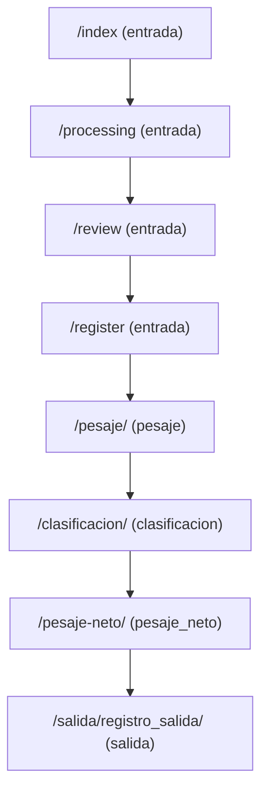

# Mapeo de Rutas y Controladores - TiquetesApp

**Fecha**: Enero 2025  
**Objetivo**: Mapear todas las rutas y controladores existentes por módulo para facilitar la migración

---

## Resumen Ejecutivo

El sistema TiquetesApp utiliza **Flask Blueprints** con **13 módulos** funcionales registrados:
- **8 blueprints activos** (entrada, pesaje, clasificación, pesaje_neto, salida, admin, api, misc)
- **3 blueprints especializados** (auth, graneles, utils)
- **2 blueprints temporalmente desactivados** (presupuesto, comparacion_guias)

Total identificado: **90+ rutas activas** distribuidas en múltiples controladores.

---

## Estructura de Blueprints y Prefijos URL

| Blueprint | Prefijo URL | Archivo Principal | Estado |
|-----------|-------------|-------------------|---------|
| `entrada` | `/` | `app/blueprints/entrada/routes.py` | ✅ Activo |
| `pesaje` | `/pesaje` | `app/blueprints/pesaje/routes.py` | ✅ Activo |
| `clasificacion` | `/clasificacion` | `app/blueprints/clasificacion/views.py`, `processing.py` | ✅ Activo |
| `pesaje_neto` | `/pesaje-neto` | `app/blueprints/pesaje_neto/routes.py` | ✅ Activo |
| `salida` | `/salida` | `app/blueprints/salida/routes.py` | ✅ Activo |
| `admin` | `/admin` | `app/blueprints/admin/routes.py` | ✅ Activo |
| `api` | `/api` | `app/blueprints/api/routes.py` | ✅ Activo |
| `misc` | `/` | `app/blueprints/misc/routes.py` | ✅ Activo |
| `auth` | `/auth` | `app/blueprints/auth/routes.py` | ✅ Activo |
| `graneles` | `/graneles` | `app/blueprints/graneles/routes.py` | ✅ Activo |
| `utils` | `/utils` | `app/blueprints/utils/routes.py` | ✅ Activo |
| `presupuesto` | `/presupuesto` | `app/blueprints/presupuesto/routes.py` | ⚠️ Comentado |
| `comparacion_guias` | `/comparacion` | `app/blueprints/comparacion_guias/routes.py` | ⚠️ Comentado |

---

## Mapeo Detallado por Módulo

### 1. 🏠 **Blueprint: entrada** (Módulo Principal)
**Prefijo**: `/` (sin prefijo)  
**Archivo**: `app/blueprints/entrada/routes.py`

| Ruta | Método | Función | Descripción | Template |
|------|--------|---------|-------------|----------|
| `/` | GET/POST | `index()` | Página principal - upload tiquetes | `templates/entrada/index.html` |
| `/index` | GET | `index()` | Página principal (alias) | `templates/entrada/index.html` |
| `/home` | GET | `home()` | Dashboard principal | `templates/entrada/home.html` |
| `/processing` | GET | `processing()` | Página de procesamiento | `templates/entrada/processing.html` |
| `/process_image` | POST | `process_tiquete_image()` | Procesa imagen OCR | JSON response |
| `/review` | GET | `review()` | Revisión datos extraídos | `templates/entrada/review.html` |
| `/update_data` | POST | `update_data()` | Actualiza datos validados | JSON response |
| `/register` | POST | `register()` | Registro final entrada | JSON response |
| `/review_pdf` | GET | `review_pdf()` | Vista PDF revisión | `templates/entrada/review_pdf.html` |
| `/registros-entrada` | GET | `registros_entrada()` | Lista registros entrada | `templates/entrada/registros_entrada_lista.html` |
| `/registro-entrada/<codigo_guia>` | GET/POST | `registro_entrada()` | Detalle registro específico | `templates/entrada/registro_entrada.html` |
| `/nueva-entrada` | GET | `nueva_entrada()` | Formulario nueva entrada | `templates/entrada/nueva_entrada.html` |
| `/entradas` | GET | `lista_entradas()` | Lista todas las entradas | `templates/entrada/entradas_lista.html` |
| `/entrada/<codigo_guia>` | GET | `entrada_detalle()` | Detalle entrada específica | `templates/entrada/entrada_detalle.html` |
| `/guia/<codigo_guia>` | GET | `ver_guia()` | Vista guía específica | Template dinámico |
| `/registrar-entrada` | POST | `registrar_entrada()` | Crear nueva entrada | JSON response |
| `/editar-entrada/<codigo_guia>` | GET/POST | `editar_entrada()` | Editar entrada existente | `templates/entrada/editar_entrada.html` |
| `/diagnostico-entradas` | GET | `diagnostico_entradas()` | Diagnóstico del sistema | `templates/entrada/diagnostico.html` |
| `/detalles-registro/<codigo_guia>` | GET | `detalles_registro()` | Detalles completos registro | `templates/entrada/detalles_registro.html` |

---

### 2. ⚖️ **Blueprint: pesaje** (Pesaje Bruto)
**Prefijo**: `/pesaje`  
**Archivo**: `app/blueprints/pesaje/routes.py`

| Ruta | Método | Función | Descripción | Template |
|------|--------|---------|-------------|----------|
| `/pesaje/<codigo>` | GET | `pesaje()` | Página principal pesaje | `templates/pesaje/pesaje.html` |
| `/pesaje-inicial/<codigo>` | GET/POST | `pesaje_inicial()` | Pesaje inicial/bruto | `templates/pesaje/pesaje_inicial.html` |
| `/pesaje-tara/<codigo>` | GET/POST | `pesaje_tara()` | Pesaje tara | `templates/pesaje/pesaje_tara.html` |
| `/procesar_pesaje_tara_directo` | POST | `procesar_pesaje_tara_directo()` | Procesa pesaje tara directo | JSON response |
| `/registrar_peso_directo` | POST | `registrar_peso_directo()` | Registra peso directo | JSON response |
| `/registrar_peso_virtual` | POST | `registrar_peso_virtual()` | Registra peso virtual | JSON response |
| `/pesajes` | GET | `lista_pesajes()` | Lista todos los pesajes | `templates/pesaje/pesajes_lista.html` |
| `/validar_pesos` | POST | `validar_pesos()` | Validación pesos vs SAP | JSON response |
| `/verificar_placa_pesaje` | POST | `verificar_placa_pesaje()` | Verificación placa en pesaje | JSON response |
| `/pesaje-neto/<codigo>` | GET | `pesaje_neto()` | Página pesaje neto | `templates/pesaje/pesaje_neto.html` |
| `/pesajes-neto-lista` | GET | `lista_pesajes_neto()` | Lista pesajes neto | `templates/pesaje/pesajes_neto_lista.html` |
| `/ver_resultados_pesaje/<codigo_guia>` | GET | `ver_resultados_pesaje()` | Resultados pesaje | `templates/pesaje/resultados_pesaje.html` |
| `/procesar_pesaje_directo` | POST | `procesar_pesaje_directo()` | Procesa pesaje OCR directo | JSON response |
| `/solicitar_autorizacion_pesaje` | POST | `solicitar_autorizacion_pesaje()` | Solicita autorización | JSON response |
| `/validar_codigo_autorizacion` | POST | `validar_codigo_autorizacion()` | Valida código autorización | JSON response |
| `/registrar_y_marcar_pepa` | POST | `registrar_y_marcar_pepa()` | Registra pepa en pesaje | JSON response |

---

### 3. 🍇 **Blueprint: clasificacion** (Clasificación IA)
**Prefijo**: `/clasificacion`  
**Archivos**: `app/blueprints/clasificacion/views.py`, `processing.py`

#### Rutas Principales (views.py)
| Ruta | Método | Función | Descripción | Template |
|------|--------|---------|-------------|----------|
| `/<codigo>` | GET | `clasificacion()` | Página principal clasificación | `templates/clasificacion/clasificacion.html` |
| `/prueba-clasificacion/<codigo>` | GET | `prueba_clasificacion()` | Prueba clasificación | `templates/clasificacion/prueba_clasificacion.html` |
| `/clasificaciones` | GET | `clasificaciones()` | Lista clasificaciones | `templates/clasificacion/clasificaciones.html` |
| `/clasificaciones/lista` | GET | `listar_clasificaciones_filtradas()` | Lista filtrada clasificaciones | `templates/clasificacion/clasificaciones_lista.html` |
| `/ver_resultados_clasificacion/<path:url_guia>` | GET | `ver_resultados_clasificacion()` | Resultados clasificación | `templates/clasificacion/resultados_clasificacion.html` |
| `/procesar_clasificacion_manual/<path:url_guia>` | GET/POST | `procesar_clasificacion_manual()` | Procesamiento manual | `templates/clasificacion/clasificacion_manual.html` |
| `/generar_pdf_clasificacion/<codigo_guia>` | GET | `generar_pdf_clasificacion()` | Genera PDF clasificación | PDF response |
| `/print_view_clasificacion/<codigo_guia>` | GET | `print_view_clasificacion()` | Vista impresión | `templates/clasificacion/print_view.html` |
| `/ver_detalles_clasificacion/<path:url_guia>` | GET | `ver_detalles_clasificacion()` | Detalles clasificación | `templates/clasificacion/detalles_clasificacion.html` |
| `/test_annotated_image/<path:url_guia>` | GET | `test_annotated_image()` | Prueba imagen anotada | `templates/clasificacion/test_image.html` |

#### Rutas de Procesamiento (processing.py)
| Ruta | Método | Función | Descripción | Template |
|------|--------|---------|-------------|----------|
| `/registrar_clasificacion` | POST | `registrar_clasificacion()` | Registra clasificación manual | JSON response |
| `/registrar_clasificacion_api` | POST | `registrar_clasificacion_api()` | API registro clasificación | JSON response |
| `/procesar_clasificacion` | POST | `procesar_clasificacion()` | Procesa clasificación automática | JSON response |
| `/iniciar_procesamiento/<path:url_guia>` | POST | `iniciar_procesamiento()` | Inicia procesamiento IA | JSON response |
| `/check_procesamiento_status/<path:url_guia>` | GET | `check_procesamiento_status()` | Estado procesamiento | JSON response |
| `/procesar_automatico` | POST | `procesar_automatico()` | Procesamiento automático | JSON response |
| `/guardar_clasificacion_final/<path:codigo_guia>` | POST | `guardar_clasificacion_final()` | Guarda clasificación final | JSON response |
| `/regenerar_imagenes/<path:url_guia>` | GET | `regenerar_imagenes()` | Regenera imágenes | JSON response |
| `/sync_clasificacion/<codigo_guia>` | GET | `sync_clasificacion()` | Sincroniza clasificación | JSON response |

---

### 4. 📊 **Blueprint: pesaje_neto** (Pesaje Neto/Tara)
**Prefijo**: `/pesaje-neto`  
**Archivo**: `app/blueprints/pesaje_neto/routes.py`

| Ruta | Método | Función | Descripción | Template |
|------|--------|---------|-------------|----------|
| `/ver_resultados_pesaje_neto/<codigo_guia>` | GET | `ver_resultados_pesaje_neto()` | Resultados pesaje neto | `templates/pesaje_neto/resultados_pesaje_neto.html` |
| `/registrar_peso_neto_directo` | POST | `registrar_peso_neto_directo()` | Registra peso neto directo | JSON response |
| `/registrar_peso_neto` | POST | `registrar_peso_neto()` | Registra peso neto | JSON response |
| `/pesaje/<codigo_guia>` | GET | `pesaje_neto_page()` | Página pesaje neto | `templates/pesaje_neto/pesaje_neto.html` |
| `/lista_pesajes_neto` | GET | `lista_pesajes_neto()` | Lista pesajes neto | `templates/pesaje_neto/lista_pesajes_neto.html` |

---

### 5. 🚪 **Blueprint: salida** (Registro Salida)
**Prefijo**: `/salida`  
**Archivo**: `app/blueprints/salida/routes.py`

| Ruta | Método | Función | Descripción | Template |
|------|--------|---------|-------------|----------|
| `/registro_salida/<codigo_guia>` | GET | `registro_salida()` | Página registro salida | `templates/salida/registro_salida.html` |
| `/completar_registro_salida` | POST | `completar_registro_salida()` | Completa registro salida | JSON response |
| `/ver_resultados_salida/<codigo_guia>` | GET | `ver_resultados_salida()` | Resultados salida | `templates/salida/resultados_salida.html` |
| `/debug_logs` | GET | `debug_logs()` | Debug logs sistema | `templates/salida/debug_logs.html` |

---

### 6. 👨‍💼 **Blueprint: admin** (Administración)
**Prefijo**: `/admin`  
**Archivo**: `app/blueprints/admin/routes.py`

| Ruta | Método | Función | Descripción | Template |
|------|--------|---------|-------------|----------|
| `/admin/migrar-registros` | GET | `migrar_registros()` | Migración de registros | `templates/admin/migrar_registros.html` |
| `/users` | GET | `lista_usuarios()` | Lista usuarios sistema | `templates/admin/users.html` |
| `/activate_user/<int:user_id>` | POST | `activate_user()` | Activa usuario | JSON response |
| `/deactivate_user/<int:user_id>` | POST | `deactivate_user()` | Desactiva usuario | JSON response |

---

### 7. 🔌 **Blueprint: api** (API REST)
**Prefijo**: `/api`  
**Archivo**: `app/blueprints/api/routes.py`

| Ruta | Método | Función | Descripción | Template |
|------|--------|---------|-------------|----------|
| `/test_webhook` | GET | `test_webhook()` | Prueba webhook | JSON response |
| `/test_revalidation` | GET | `test_revalidation()` | Prueba revalidación | JSON response |
| `/verificar_placa` | POST | `verificar_placa()` | Verificación placa API | JSON response |
| `/api/dashboard/proveedores` | GET | `dashboard_proveedores()` | API dashboard proveedores | JSON response |

---

### 8. 🔧 **Blueprint: misc** (Utilidades)
**Prefijo**: `/` (sin prefijo)  
**Archivo**: `app/blueprints/misc/routes.py`

| Ruta | Método | Función | Descripción | Template |
|------|--------|---------|-------------|----------|
| `/dashboard` | GET | `dashboard()` | Dashboard principal | `templates/dashboard.html` |
| `/upload` | GET/POST | `upload_file()` | Upload de archivos | `templates/misc/upload.html` |
| Múltiples rutas de utilidades | | | | |

---

### 9. 🔐 **Blueprint: auth** (Autenticación)
**Prefijo**: `/auth`  
**Archivo**: `app/blueprints/auth/routes.py`

| Ruta | Método | Función | Descripción | Template |
|------|--------|---------|-------------|----------|
| `/register` | GET/POST | `register()` | Registro usuarios | `templates/auth/register.html` |
| `/login` | GET/POST | `login()` | Login usuarios | `templates/auth/login.html` |
| `/logout` | GET | `logout()` | Logout usuarios | Redirect |

---

### 10. 🌾 **Blueprint: graneles** (Graneles Especializado)
**Prefijo**: `/graneles`  
**Archivo**: `app/blueprints/graneles/routes.py`

| Ruta | Método | Función | Descripción | Template |
|------|--------|---------|-------------|----------|
| `/registro_entrada` | GET | `registro_entrada()` | Registro entrada graneles | `templates/graneles/registro_entrada_graneles.html` |
| `/buscar_placa_granel` | POST | `buscar_placa_granel()` | Búsqueda placa graneles | JSON response |
| `/guardar_registro_granel` | POST | `guardar_registro_granel()` | Guarda registro granel | JSON response |
| `/guia/<int:id_registro_granel>` | GET | `ver_guia()` | Ver guía granel | `templates/graneles/guia.html` |
| `/generar_pdf/<int:id_registro_granel>` | GET | `generar_pdf()` | Genera PDF granel | PDF response |
| `/guia-centralizada/<int:id_registro_granel>` | GET | `ver_guia_centralizada()` | Vista centralizada | `templates/graneles/guia_centralizada.html` |
| `/validar_foto_pesaje/<int:id_registro_granel>` | POST | `validar_foto_pesaje()` | Validación foto pesaje | JSON response |
| `/procesar_documento_ocr` | POST | `procesar_documento_ocr()` | OCR documentos LangChain | JSON response |
| `/actualizar_datos_documentos/<int:id_registro_granel>` | POST | `actualizar_datos_documentos()` | Actualiza datos documentos | JSON response |
| `/registrar-primer-pesaje/<int:id_registro_granel>` | GET/POST | `registrar_primer_pesaje()` | Primer pesaje | `templates/graneles/registrar_primer_pesaje.html` |
| `/lista-pendientes-guarda` | GET | `lista_pendientes_guarda()` | Lista pendientes guarda | `templates/graneles/lista_pendientes_guarda.html` |
| `/inspeccion-vehiculo/<int:id_registro_granel>` | GET/POST | `inspeccion_vehiculo()` | Inspección vehículo | `templates/graneles/inspeccion_vehiculo.html` |

---

### 11. 🛠️ **Blueprint: utils** (Utilidades)
**Prefijo**: `/utils`  
**Archivo**: `app/blueprints/utils/routes.py`

| Ruta | Método | Función | Descripción | Template |
|------|--------|---------|-------------|----------|
| Utilidades varias | | | | |

---

### 12. ⚠️ **Blueprints Comentados**

#### Blueprint: presupuesto
**Estado**: Temporalmente comentado por problemas con pandas  
**Prefijo**: `/presupuesto`  
**Archivo**: `app/blueprints/presupuesto/routes.py`

| Ruta | Método | Función | Descripción | Template |
|------|--------|---------|-------------|----------|
| `/upload` | POST | `upload_presupuesto()` | Upload presupuesto | JSON response |

#### Blueprint: comparacion_guias
**Estado**: Temporalmente comentado por problemas con pandas  
**Prefijo**: `/comparacion`  
**Archivo**: `app/blueprints/comparacion_guias/routes.py`

---

## Flujo de Navegación Principal

### Ruta Crítica del Proceso:

### Navegación Secundaria:
- **Dashboard**: `/dashboard (misc)` - Centro de control
- **Listas**: Múltiples endpoints para listados por módulo
- **API**: `/api/*` - Integraciones externas
- **Admin**: `/admin/*` - Gestión administrativa

---

## Análisis de Dependencias Entre Módulos

### Dependencias Críticas Identificadas:
1. **entrada → pesaje**: Código guía generado en entrada es requerido para pesaje
2. **pesaje → clasificacion**: Datos de pesaje influyen en clasificación 
3. **clasificacion → pesaje_neto**: Resultados de clasificación afectan peso neto
4. **pesaje_neto → salida**: Peso neto final es requerido para salida
5. **misc**: Provee utilidades transversales (dashboard, upload, PDFs)
6. **api**: Endpoints de integración usados por múltiples módulos
7. **auth**: Sistema de autenticación transversal

### Módulos Independientes:
- **graneles**: Sistema completamente independiente con su propio flujo
- **admin**: Funciones administrativas independientes

---

## Identificación de Patrones de URL

### Patrones Comunes:
- **Vista**: `/<modulo>/<codigo>` - Página principal del módulo
- **Lista**: `/<modulo>s` o `/<modulo>/lista` - Listado de elementos
- **Procesamiento**: `/procesar_*` - Acciones de procesamiento
- **Resultados**: `/ver_resultados_*` - Vista de resultados
- **API**: Rutas POST que retornan JSON
- **PDFs**: `/generar_pdf_*` - Generación de documentos

---

## Próximos Pasos para Sub-tarea 1.4

### Para mapear dependencias:
1. **Analizar sesiones y estados compartidos** entre módulos
2. **Mapear flujo de datos** entre controladores
3. **Identificar dependencias de base de datos** entre tablas
4. **Documentar APIs internas** utilizadas entre módulos

---

**Documento generado**: Enero 2025  
**Próxima actualización**: Al completar Sub-tarea 1.4 